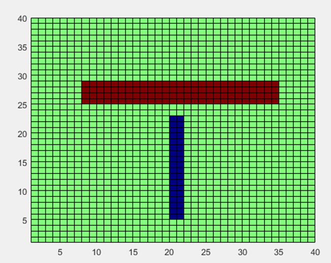
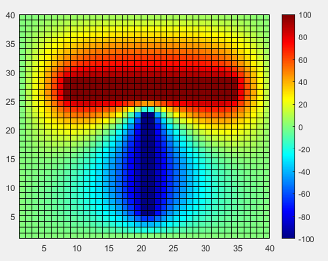
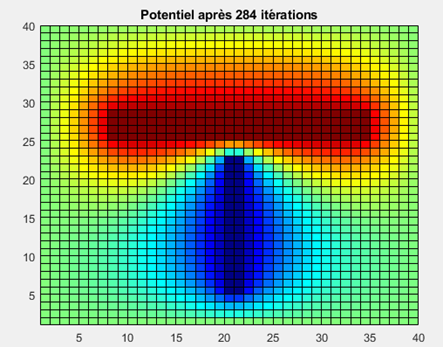
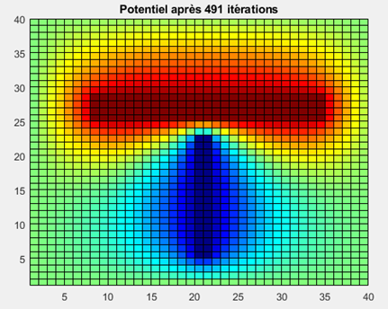
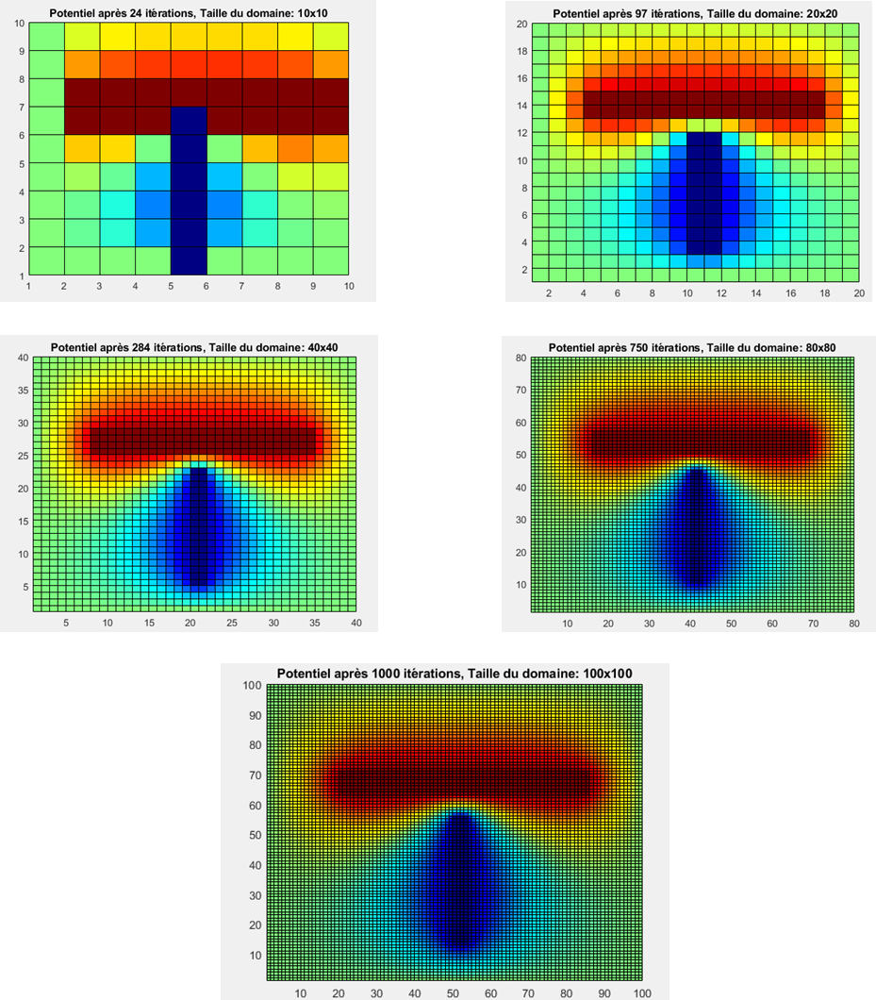
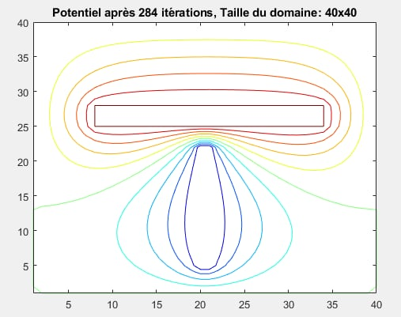
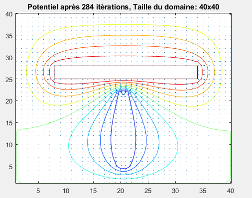

<p align="center">  </p>

#                                                            ESE_CME_2425
JACQUOT NOLAN GUIFFAULT GABRIEL ESE 2024
## I.	Exécution du script tp00.m

## Objectif de cette étape
L’objectif de cette étape est d’exécuter un script MATLAB/Octave permettant de résoudre numériquement l’équation de Laplace en 2D à l’aide de la méthode des différences finies. Ce script initialise un domaine de calcul de dimensions 40×40 avec des potentiels sources et des conditions aux limites, et produit une visualisation graphique du potentiel V dans tout le domaine.
### Description et analyse du script
### _1. Définition des paramètres et du domaine de calcul_

•	Les dimensions du maillage unitaire  (dx=1, dy=1) ainsi que le nombre de cellules (Nx=40, Ny=40) sont définis pour le domaine.

•	Les conditions aux limites sont fixées à V=0 sur les bords du domaine, simulant un potentiel nul à l’infini.

•	Deux conducteurs sont définis comme sources de potentiel avec :

 o	V1=100 V pour le premier conducteur.
 
 o	V2=−100V pour le second conducteur.
 
### _2. Initialisation et conditions aux limites_

•	Une matrice V est initialisée à zéro pour représenter le potentiel dans tout le domaine.

•	Les conditions aux limites sont appliquées sur les bords du domaine, garantissant V=0 sur les extrémités (x=1, x=40, y=1, y=40).

### _3. Définition des conducteurs_
   
Les conducteurs sont positionnés dans le domaine :

•	Le premier conducteur est représenté par une barre horizontale située entre les cellules (25:28,8:34) avec un potentiel V=100.

•	Le second conducteur est une barre verticale entre les cellules (5:22,20:21)(5:22, 20:21)(5:22,20:21) avec un potentiel V=−100V.

##  Visualisation des résultats
   
Cette représentation graphique est produite :
### 1.	Visualisation des conditions initiales
 Ce graphe montre les conducteurs +100 V (en rouge) et −100V (en bleu) dans un domaine initialisé à V=0 :
 

<p align="center">  </p>

> [!TIP]
> ````
> figure(11);
> colormap("jet");
> pcolor(V);
> ````
> permet d'obtenir le meme schéma de couleur que le sujet, ce qui permet de mieux reperer les erreurs éventuelles.

# II.	Résolution itérative de l’équation de Laplace (200 itérations)

## Objectif de cette étape
L’objectif est de modifier le script MATLAB/Octave pour résoudre numériquement l’équation de Laplace en 2D à l’aide de la méthode des différences finies (DF) sur un domaine de 40×40. Cette résolution itérative (200 itérations) permet d’obtenir une distribution stable du potentiel V dans tout le domaine.
### Description de la méthode et du script
Dans cette étape, une boucle itérative est ajoutée pour appliquer l’équation discrétisée de Laplace :

V(i,j)=0.25*( V(i+1,j) + V(i-1,j) + V(i,j+1) + V(i,j-1) )

Le potentiel est calculé pour chaque point du domaine interne (excluant les bords) jusqu’à convergence approximative après 200 itérations.

### Modifications apportées au script
1.	Ajout d’une boucle itérative pour mettre à jour les valeurs de V(i,j) selon la méthode DF.
   
3.	Réimposition des potentiels fixes +100V et −100V sur les conducteurs à chaque itération pour garantir leur stabilité.

### Résultat
Ce graphe obtenu montre une distribution stable du potentiel après 200 itérations :

•	Une transition progressive entre les potentiels +100V (en rouge) et −100V (en bleu).

•	Un gradient de potentiel visible dans tout le domaine, illustrant les interactions entre les deux conducteurs.

 <p align="center">  </p>

# III.	Convergence et seuil de convergence

## Objectif de cette étape
L’objectif est de résoudre l’équation de Laplace en 2D en ajoutant un critère de convergence basé sur la variation maximale du potentiel V entre deux itérations successives. Cette méthode permet d’arrêter la simulation lorsque la solution devient suffisamment stable, évitant ainsi un nombre arbitraire d’itérations.
## Méthode et description du script
### 1. Paramètres de convergence

•	Seuil de convergence (seuil) : Définit la précision souhaitée pour la variation maximale du potentiel entre deux itérations successives. Dans ce script, le seuil est défini à 0.010.010.01, mais d'autres valeurs (0.001,0.0001,…)peuvent être testées.

•	Nombre maximum d’itérations (max_iterations) : Définit une limite pour éviter des boucles infinies si la convergence n'est pas atteinte.

### 2. Boucle de calcul
•	À chaque itération, une copie de l’état précédent du potentiel (V) est conservée dans Vold.

•	La méthode des différences finies est appliquée pour mettre à jour 

V : V(i, j) = 0.25 * (V(i+1, j) + V(i-1, j) + V(i, j+1) + V(i, j-1));

•	Les potentiels des conducteurs (v1 et v2) sont réimposés après chaque mise à jour pour garantir leur stabilité.

•	Le test de convergence compare V et Vold en calculant la variation maximale : diff=max(∥V−Vold∥)

•	La boucle s’arrête si la variation maximale devient inférieure au seuil.

### 3. Visualisation des résultats

•	Le potentiel V final est affiché avec pcolor après la convergence ou après avoir atteint le nombre maximum d’itérations.

## Résultats 
•	Le nombre d’itérations nécessaire pour atteindre la convergence dépend du seuil choisi (0.01,0.001, etc.). Par exemple :

o	Avec seuil=0.01, la convergence est atteinte en environ 284 itérations :
 <p align="center">  </p>
o	Avec seuil=0.001, la convergence est atteinte en environ 491 itérations :

<p align="center">  </p>
 
•	La méthode permet d’éviter des calculs inutiles tout en obtenant une solution stable.

# IV.	Étude de l’influence de la taille du domaine de calcul

## Objectif de cette étape
Cette étape explore l'effet de la taille du domaine de calcul sur la distribution du potentiel V et la convergence des résultats. En augmentant ou réduisant les dimensions du domaine (Nx×Ny), on évalue l'impact sur la répartition des potentiels et la précision de la solution.
Méthode et description du script
### 1. Dimensions variables

•	Le domaine de calcul est testé pour plusieurs tailles : 10×10, 20×20, 40×40, 80×80, et 100×100.

•	Les proportions des cellules sources (V1=+100V et V2=−100V) sont ajustées proportionnellement à la taille du domaine.
### 2. Boucle de calcul pour chaque taille
Initialisation :

•	Les conditions aux limites (V=0) sont appliquées sur tous les bords du domaine.

•	Une matrice V est initialisée à zéro pour représenter le potentiel dans tout le domaine.

Itérations pour chaque taille :

•	À chaque itération, le potentiel V est mis à jour selon la méthode des différences finies :

V(i, j) = 0.25 * (V(i+1, j) + V(i-1, j) + V(i, j+1) + V(i, j-1))

•	Les potentiels des conducteurs (v1 et v2) sont réimposés pour garantir leur stabilité.

## Critère de convergence :
•	Une copie de V (Vold) est conservée à chaque itération.

•	La variation maximale entre deux itérations est calculée : diff=max(∣V−Vold∣)

•	La boucle s’arrête si diff<seuil (seuil=0.01) ou si le nombre maximum d’itérations (max_iterations=1000) est atteint.

### 3. Visualisation des résultats
•	Une figure est générée pour chaque taille de domaine, montrant la distribution finale du potentiel après convergence.

## Résultats :
 <p align="center">  </p>

# V.	Affichage des lignes équipotentielles

## Objectif de cette étape :
L’objectif est de visualiser les lignes équipotentielles du potentiel V dans le domaine de calcul.
Ces lignes représentent les zones où le potentiel est constant, offrant une meilleure compréhension
des interactions électrostatiques dans le système.

## Méthode et description

### 1. Initialisation du calcul :
• Les dimensions du domaine sont configurées pour différentes tailles (10 × 10, 20 × 20, 40 × 40, 80 × 80, 100 × 100).

• Les conducteurs sont positionnés proportionnellement à chaque taille, avec des potentiels fixés (+100 V pour le conducteur 1, -100 V pour le conducteur 2).

• Les conditions aux limites (V = 0) sont appliquées sur les bords.

### 2. Résolution de l’équation de Laplace :

• Une résolution itérative est réalisée jusqu’à ce que le critère de convergence soit atteint (seuil = 0.01) ou jusqu’à un maximum de 1000 itérations.

• Le potentiel V est mis à jour à chaque itération, en réimposant les potentiels fixes pour les conducteurs.

### 3. Visualisation des lignes équipotentielles :
• La fonction contour est utilisée pour tracer les lignes équipotentielles superposées à la carte de couleurs du potentiel V.

 <p align="center">  </p>
 
• Les figures obtenues montrent les lignes équipotentielles pour chaque taille de domaine, mettant en évidence les transitions entre les zones de potentiel.
 
# VI.	Calcul du champ électrostatique

## Objectif de cette étape :
L’objectif est de calculer et de représenter les composantes du champ électrique E⃗ dans tout le domaine de calcul.
Le champ électrique est obtenu en calculant le gradient du potentiel V, ce qui permet de visualiser les interactions électrostatiques à travers le domaine.

## Méthode et description

### 1. Initialisation du calcul :
• Les dimensions du domaine sont configurées pour différentes tailles (10 × 10, 20 × 20, 40 × 40, 80 × 80, 100 × 100).

• Les conducteurs (+100 V et -100 V) sont positionnés proportionnellement à chaque taille, en maintenant leurs emplacements relatifs.

• Les conditions aux limites (V = 0) sont appliquées sur les bords du domaine.

### 2. Calcul du potentiel V :
• L’équation de Laplace est résolue par différences finies en itérant jusqu’à ce que le critère de convergence soit atteint (seuil = 0.01) ou jusqu’à un maximum de 1000 itérations.

• Le potentiel V est mis à jour à chaque itération en réimposant les valeurs fixes pour les conducteurs.

### 3. Calcul des composantes du champ électrique :
• Une fois la convergence atteinte, les composantes Ex et Ey du champ électrique sont calculées comme suit :

Ex = −∂V/∂x, Ey = −∂V/∂y

• Ces composantes sont obtenues en utilisant la fonction gradient de MATLAB/Octave, qui calcule le gradient spatial du potentiel.

### 4. Visualisation des résultats :
   
• Une représentation graphique du potentiel V est superposée aux lignes équipotentielles à l’aide de la fonction contour.

• Les vecteurs représentant le champ électrique E⃗ sont affichés avec la fonction quiver, indiquant la direction et la magnitude du champ en chaque point.
<p align="center">  </p>
# VII.	 Calculs de capacités


## Objectif de cette étape :

L’objectif est de calculer la capacité Cij entre deux conducteurs dans un domaine 2D en utilisant la solution de l’équation de Laplace.
La capacité est obtenue à partir de la charge totale Qi sur un conducteur et de la différence de potentiel entre les deux conducteurs (Vj − Vi).

## Méthode et description

### 1. Initialisation du calcul :
• Le domaine est configuré avec des dimensions variables (10 × 10, 20 × 20, 40 × 40, 80 × 80, 100 × 100).

• Les conducteurs sont positionnés proportionnellement à la taille du domaine, avec des potentiels fixés (+100 V pour le conducteur 1, -100 V pour le conducteur 2).

• Les conditions aux limites (V = 0) sont appliquées sur tous les bords.

### 2. Résolution de l’équation de Laplace :
• Une résolution itérative est réalisée jusqu’à atteindre un critère de convergence (seuil = 0.01) ou un maximum de 1000 itérations.

• Le potentiel V est mis à jour à chaque itération, avec réimposition des potentiels des conducteurs.

### 3. Calcul de la charge Qi :
• Les composantes Ex et Ey du champ électrique sont calculées à partir du gradient du potentiel :

Ex = −∂V/∂x, Ey = −∂V/∂y

• L’intégrale discrète de Gauss est utilisée pour calculer la charge Qi entourant le conducteur 1 :

Qi = ε0 ∮ E⃗ ⋅ dS⃗

• Cette intégrale est approximée comme la somme des contributions sur les quatre côtés du contour entourant le conducteur :

- Bord gauche : Contribution de Ey le long du côté gauche.
  
- Bord droit : Contribution de Ey le long du côté droit.
  
- Bord haut : Contribution de Ex le long du haut.
  
- Bord bas : Contribution de Ex le long du bas.


  
### 4. Calcul de la capacité Cij :

• La capacité entre les conducteurs est obtenue par la relation :

Cij = Qi / (Vj − Vi)

